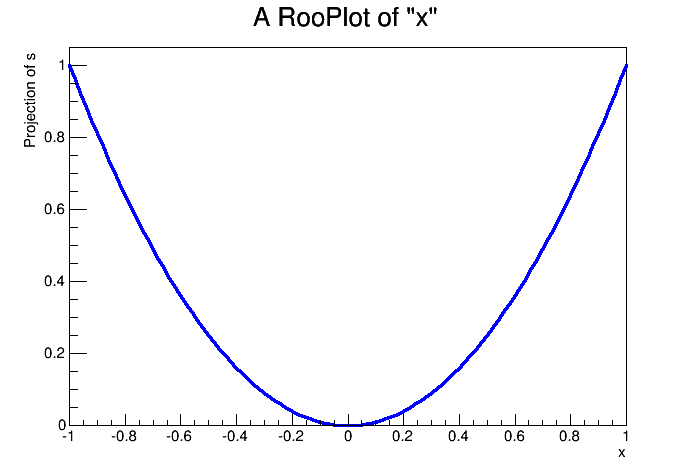

roofit-python-wrapper
=====================

authors: Kyle Cranmer <kyle.cranmer@nyu.edu>, Lukas Heinrich

A clean example of a RooAbsReal from ROOT's RooFit statistical modeling language making a call back to some python code.

**Build**

Requires ROOT installed with --enable-roofit --enable-python
your environment should be set with `source $ROOTSYS/bin/thisroot.sh`
At that point make should work (it is using ROOT's generic Makefile)

**Test**

```
from ROOT import *
gSystem.Load( 'libRooFitPythonWrapper' )

def myFunction(x):
   #return x*x as an example
   return x*x 

x = RooRealVar('x','x',-1,1)
s = RooPyWrapper('s','s',x)
s.RegisterCallBack( myFunction );

c1 = TCanvas('c1')
frame = x.frame()
s.plotOn(frame)
frame.Draw()
c1.SaveAs('RooPyWrapper.png')
```


